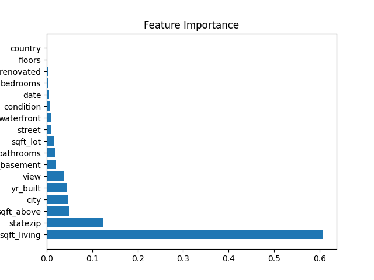

# automl-house-price-prediction
“Automated ML pipeline with data cleaning &amp; reports” 
Predict housing prices using Random Forest and Gradient Boosting models with automated preprocessing
Dataset: 4600 rows, 18 features
Model performance
Best Model: Gradient Boosting  
R² Score: 0.049  
MSE: 969747581931.46

